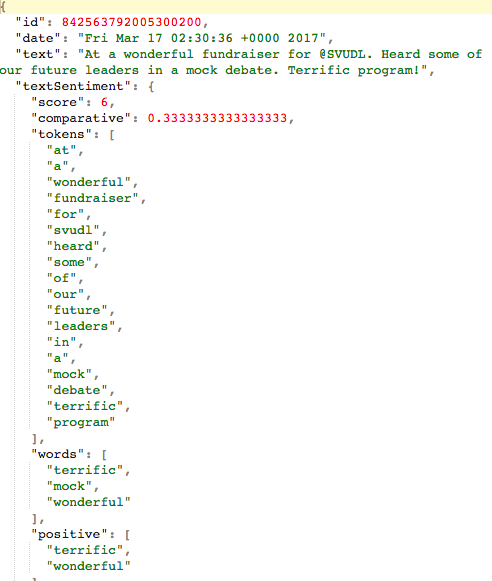
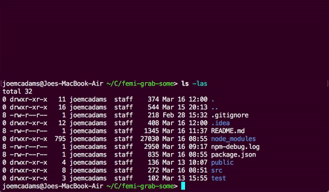
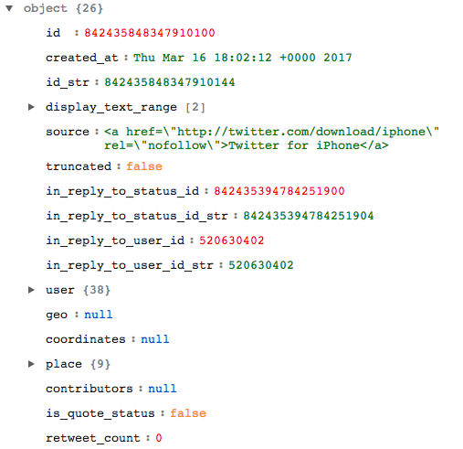

Overview
======

__Femi-Gnab-Some__ (working title, also thinking of Patrignarky as an alternative) is a web application designed 
to pull live Twitter data based on a given geocode (a given latitude, longitude, and radius), and analyze the
sentiment of tweets that contain text with a gendered subject. The goal is to analyze a distinction, if any, 
in the treatment of digital persons on the basis of gender. 

Initial Results
------

Currently, the server can extract the date, text, user (including followers and name), users mentioned, topics mentioned,
and overall sentiment of every tweet in a given geocode. 

For the purposes of testing, I've been using San Francisco as a city
to test this app out, and the results of each tweet look something like this:



While this is nifty, it's not super heplful right now. Moving forward, I plan to:
* Create a database layer to save tweets over time
* Create a visual graphing tool to look at overall sentiment of tweets, filterable by date, user's gender, and 
potentially the topics extracted from tweets

How it Works
------

To get a sense of what this is, I'll walk through the following steps:
 1. Getting information about a tweet of a user in a given location
 2. Assembeling relevant data, analyzing sentiment, and extracting topics
 3. Writing results of the previous steps to a file for later use

#### Getting a Tweet

Twitter has a nicely documented [API](https://dev.twitter.com/docs) that enables developers to request data from their
servers if they follow some basic guidelines. After creating a developer account, registering my application, and 
storing my credentials in a privately kept `credentials.json` file, I can set up requests to Twitter using
a simple HTTP GET request (I use the package [Twit](https://github.com/ttezel/twit) to handle most of the heavy work for me)
 
 In the code, this is what gets that done:
 ```javascript
 // credentials = require('credentials.json')
 
 const twitter = new Twit(credentials) // load authentication details
 const sanFrancisco = [ '-122.75', '36.8', '-121.75', '37.8' ] // [lat, long, lat, long] coordinates of SF
 const stream = twitter.stream('statuses/filter', { locations: sanFrancisco }) // listen for new tweets in SF
 stream.on('tweet', (tweet) => { // when a new tweet appears
     logTweet(tweet) // log some details of it in a helper function
 })
 ```

Here's what the server looks like in action when it's listening for tweets:



Cool, cool. So you're receiving tweets? It looks like a bunch of sentences with the word tweet followed by a really 
long number. How is _that_ helpful?

Right now, I'm just printing the id of each tweet out to the screen, then saving all the details of each tweet in a 
text file. I'll do some more analysis of it in the next section. The data received from Twitter's API is in a standard 
JavaScript Object Notation (JSON) format that looks like this:




####     Extracting and Analyzing Relevant Data

Each tweet has a unique id, details about the user (including the number of followers they have, their name, their 
description), details about when and where the tweet occurred, and plenty more information. I'll collect the following
information, and extract some of my own from analyzing the topics and sentiment of the tweet's text:
  
``` javascript
const extractDetailsFrom = (tweet) => {
    const id = tweet.id
    const date = tweet.created_at
    const text = tweet.text
    const textSentiment = sentiment(tweet.text) // get sentiment of text, as well as all positive, negative words
    const textTopics = nlp(tweet.text).topics().data() // get info on sentence's topics (people, places)
    const user = {
        id: tweet.user.id,
        name: tweet.user.name,
        location: tweet.user.location,
        followerCount: tweet.user.followers_count,
        friendsCount: tweet.user.friends_count,
        favoritesCount: tweet.user.favourites_count,
        statusesCount: tweet.user.statuses_count,
        profileImage: tweet.user.profile_image_url
    }
    const usersMentioned = tweet.user.user_mentions
    return {
        id,
        date,
        text,
        textSentiment,
        textTopics,
        user,
        usersMentioned
    }
}
```

This describes the overall skeleton of the data I want to collect, but it's hard to visualize without an example. In 
the above code, the line 

```const textSentiment = sentiment(tweet.text)```

stores information about the words ("tokens") in a sentence, a comparative score (an overall score from -7 to 7),
and a list of all positive and negative words in a variable called `textSentiment`. In the line below it,

```const textTopics = nlp(tweet.text).topics().data()```

people and places mentioned in the sentence (as well as the best-guess to the gender of a person's name) are stored in 
a variable called `textTopics`. 


#### Writing Results to a File

Once the data is nicely wrapped up, I'd like to save it to a file to use later. To do this, I simply call the following
function:

``` javascript
const logTweet = (tweet) => {
    const details = extractDetailsFrom(tweet)
    const logMessage = `${JSON.stringify(details)}`
    if (details.textSentiment.score !== 0) { // check the tweet has some positive/negative words
        fs.writeFile(`server/output/san-francisco/TWEET-${tweet.id}.txt`, logMessage, (err) => {
            if (err) {
                return console.log(err)
            }
            console.log(`Logged a tweet: [${tweet.id}]`)
        })
    }
}

```

I check to make sure the tweet has _some_ emotion, then I write its details to a file suffixed with the id of the tweet 
so each tweet has its own unique file

Major Packages of Interest
------

[Compromise](https://nlp-expo.firebaseapp.com/) - A syntactically intuitive natural language processing library. 
Comes with an API for parsing sentences into specific clauses, nouns, people, and topics (to name a few); it even gives 
a best-guess of inferred gender.

[Sentiment](https://github.com/thisandagain/sentiment) - A sentiment analysis library based on the AFINN-165 wordlist,
"a list of English words rated for valence with an integer between minus five (negative) and plus five (positive). 
The words have been manually labeled by Finn Årup Nielsen in 2009-2011." [Read more](http://www2.imm.dtu.dk/pubdb/views/publication_details.php?id=6010)

Tech Stack Used
------

Major Frameworks
* Node and Express for the server routes (and API endpoints eventually)
* React for the view engine (using the fantastic tool [create-react-app](https://github.com/facebookincubator/create-react-app))
* SCSS for CSS pre-processing

